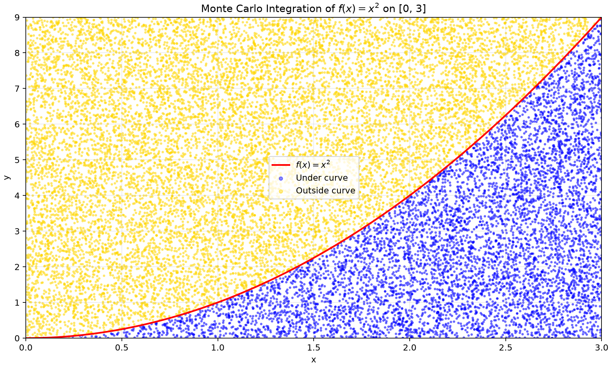

# Laporan Praktikum: Monte Carlo Simulation - Integration

## 1. Pendahuluan

Integrasi numerik digunakan ketika integral tentu sulit atau tidak praktis dihitung secara analitis. Metode Monte Carlo memperkirakan luas dengan mengambil sampel acak pada daerah pembatas, lalu menghitung proporsi titik yang memenuhi kondisi di bawah kurva. Metode ini sangat berguna pada persoalan berdimensi tinggi, walaupun untuk satu dimensi metode deterministik sering lebih efisien.

Praktikum ini mengaproksimasi integral fungsi f(x)=x^2 pada interval [0,3]. Nilai analitisnya adalah integral dari 0 sampai 3 untuk x^2 dx = 9.

## 2. Metode

- Bahasa dan pustaka: Python, NumPy, dan Matplotlib.
- PRNG: numpy.random.default_rng dengan seed 2, sehingga hasil dapat direproduksi.
- Batas integrasi: a=0 dan b=3.
- Deteksi minimum/maksimum: fungsi dievaluasi pada 1.000.001 posisi yang membagi interval menjadi 1.000.000 langkah. Hasilnya ymin=0 dan ymax=9.
- Daerah pembatas: A=(b-a)(ymax-ymin)=(3-0)(9-0)=27.
- Simulasi: dibuat N=1.000.000 titik (x,y), dengan x~U(0,3) dan y~U(0,9). Titik dihitung sebagai berada di bawah kurva jika y<=x^2.
- Estimator integral: I_hat=(M/N)A, dengan M jumlah titik di bawah kurva.

## 3. Hasil

| Besaran | Nilai |
|---|---:|
| Seed | 2 |
| Jumlah langkah deteksi min-maks | 1.000.000 |
| Jumlah titik acak, N | 1.000.000 |
| ymin, ymax | 0, 9 |
| Luas daerah pembatas, A | 27 |
| Titik di bawah kurva, M | 333.848 |
| Integral Monte Carlo, I_hat | 9,013896 |
| Integral eksak | 9,000000 |
| Galat absolut | 0,013896 |
| Galat relatif | 0,1544% |
| Standard error estimator | 0,012733 |
| Interval kepercayaan 95% | [8,988940, 9,038852] |

Kurva merah menunjukkan f(x)=x^2, titik biru berada di bawah kurva, dan titik kuning berada di luar kurva. Untuk menjaga grafik tetap terbaca, visualisasi menampilkan sampel representatif sebanyak 20.000 titik; perhitungan tetap memakai seluruh 1.000.000 titik.

## 4. Pembahasan

Hasil estimasi 9,013896 dekat dengan nilai eksak 9, dengan galat relatif hanya 0,1544%. Nilai eksak juga berada pada interval kepercayaan 95%, sehingga hasil simulasi konsisten dengan nilai teoritis. Selisih muncul karena Monte Carlo menggunakan sampel acak; proporsi titik di bawah kurva tidak akan tepat sama dengan proporsi luas sebenarnya pada setiap eksperimen.

Secara umum, ketidakpastian estimator Monte Carlo berorde 1/sqrt(N). Karena itu, menambah jumlah titik acak mengurangi galat acak, tetapi pengurangannya melambat: untuk kira-kira membagi dua standard error, diperlukan sekitar empat kali jumlah titik. Seed tetap dipakai agar eksperimen dapat diulang dengan hasil yang sama.

## 5. Kesimpulan

Metode Monte Carlo berhasil mengaproksimasi integral f(x)=x^2 dari 0 sampai 3 dengan nilai 9,013896, dekat terhadap nilai eksak 9. Deteksi min-maks menghasilkan daerah pembatas yang tepat, yaitu 27, dan visualisasi memperlihatkan hubungan antara proporsi titik di bawah kurva dan luas integral.

Untuk meningkatkan akurasi, jumlah titik acak dapat ditambah. Efisiensi juga dapat ditingkatkan melalui pembangkitan bilangan acak yang berkualitas dan teknik variance reduction, misalnya stratified sampling atau importance sampling.
